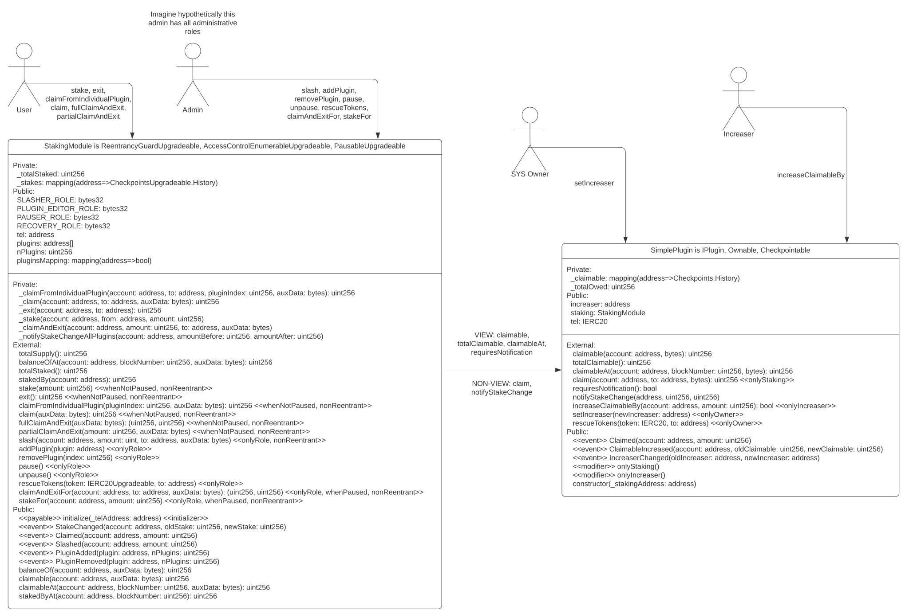

# Telcoin contest details

- 10,000 USDC main award pot
- Join [Sherlock Discord](https://discord.gg/MABEWyASkp)
- Submit findings using the issue page in your private contest repo (label issues as med or high)
- [Read for more details](https://docs.sherlock.xyz/audits/watsons)
- Starts November 17, 2022 15:00 UTC
- Ends November 20, 2022 15:00 UTC

# Resources

- [Website](https://www.telco.in/)
- [Twitter](https://twitter.com/telcoin)
- [Medium](https://telcoin.medium.com/)

# On-chain context

TO FILL IN BY PROTOCOL

```
DEPLOYMENT: `Polygon`
ERC20: [e.g. any, none, USDC, USDC and USDT]
ADMIN: [trusted, restricted, n/a]
```

# Audit scope

# About Telcoin

# TEL Staking
The staking design involves two main components: the `StakingModule` and `IPlugin`'s.

The `contracts/StakingModule.sol` contract is what users directly interact with and holds users' stakes. 
It exposes mutative methods such as `stake`, `claim` and `exit` as well as view methods such as `balanceOf` and `stakedBy`. 
The `StakingModule` is behind a Transparent Proxy to make it upgradable. 

To actually accrue yield, one or more `IPlugin` contracts are 'connected' to the staking module. 
These contracts are responsible for accruing/generating yield for stakers, which the `StakingModule` pulls from. 

The separation of the `StakingModule` and its `IPlugin`s allows for different types of yield to be added and removed from staking while not requiring the `StakingModule` to be upgraded. 

In addition to the normal staking functions called by users, the `StakingModule` has some other functions that can be called by administrative roles. 
These include: `slash`, `addPlugin`, `removePlugin`, `pause` and `unpause`.

Currently there is only one `IPlugin` contract implemented, which is `SimplePlugin`. 
`SimplePlugin` is the simplest plugin possible, it has a designated address that can increase the rewards of an individual account by calling `increaseClaimableBy`. 

The `SimplePlugin`'s `increaser` (the address that is allowed to increase the rewards of an account) will be the `FeeBuyback` contract. The `FeeBuyback` contract executes swaps on behalf of a user's smart contract wallet, takes a portion of the trading fee, buys TEL with it, and gives it to another account via the `SimplePlugin`.

There is a single function on `FeeBuyback` called `submit`. This allows an EOA to perform two swaps in the same function, and then provides the resulting Telcoin from the second swap to the `SimplePlugin` as a reward for the referrer for the user performing the swap. The order of events for the buy-back contract is:
1. Provide the user's wallet with the payload necessary to perform their swap.
2. If there is no referral content provided, successfully exit.
3. If the user paid their fee in TEL, there is no need to perform a swap. Get TEL from safe and provide a reward to staking plugin, successfully exit.
4. If the user paid their fee in a currency that is an ERC20 token, create an allowance for the aggregator to perform a swap and retrieve tokens from the safe.
5. Perform the secondary swap and provide a reward to staking plugin, successfully exit.

## Versions
npm: `8.19.2`
node: `18.10.0`
hardhat: `2.8.4`

## Running Tests
`yarn install`

`npx hardhat test`

## Diagram
(For UML diagram generated by `sol2uml` check [`diagrams/uml.svg`](./diagrams/uml.svg))


(For more on the fee buy back mechanism please check [`diagrams/composition.svg`](./diagrams/composition.svg) or [`diagrams/fbbUML.svg`](./diagrams/fbbUML.svg))